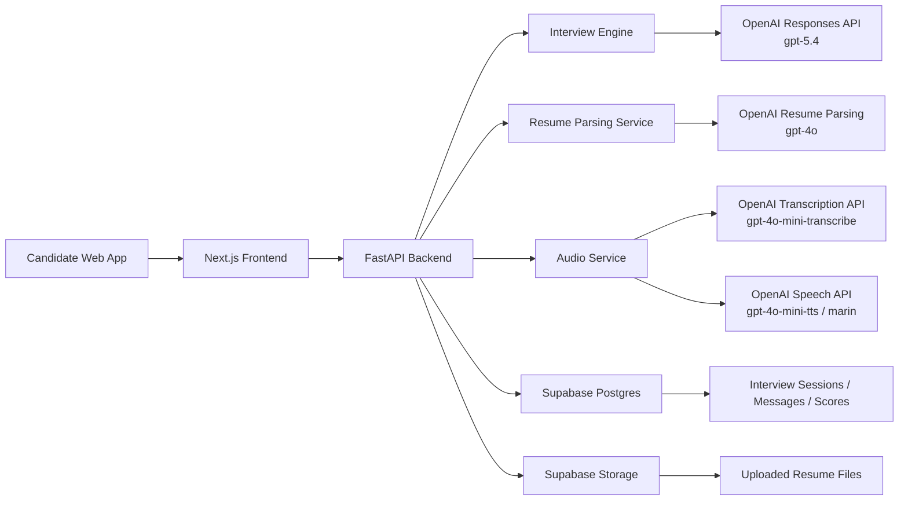
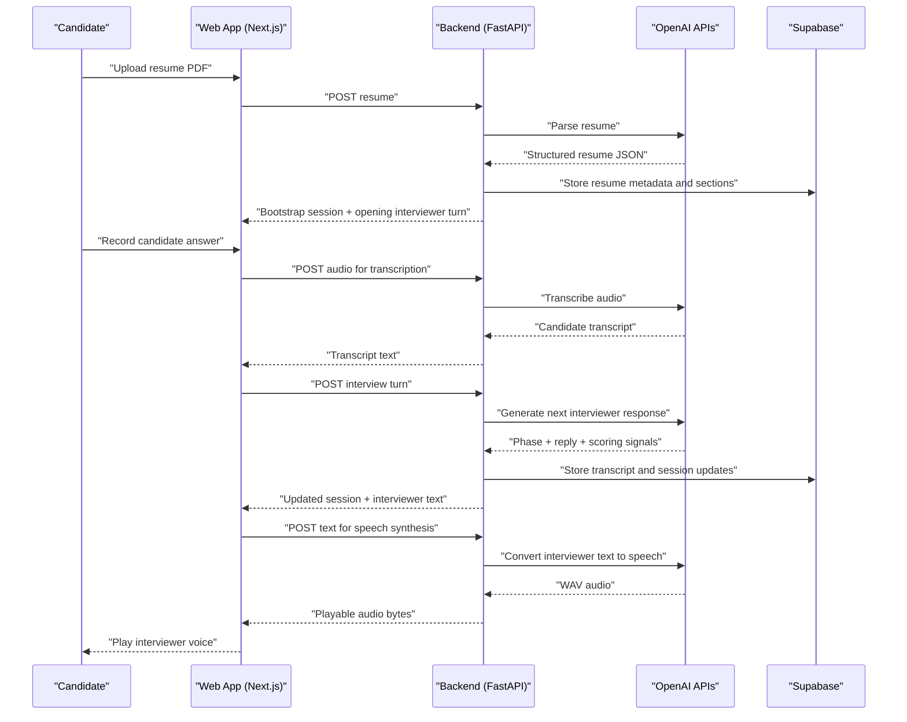
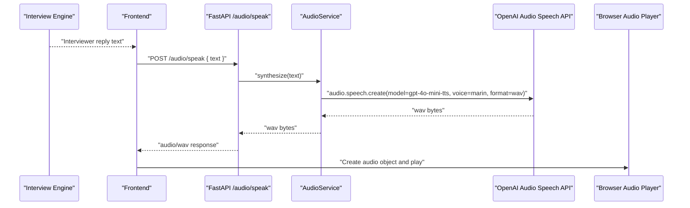

# PRD: Interviewing Agent

## Document Status

- Status: Maintained product baseline
- Last updated: 2026-06-22
- Source inputs: `docs/archive/discovery/ideas.md`, `docs/archive/discovery/concept-v0.md`, `docs/examples/job-description.md`

## 1. Product Summary

Build an audio-first mock interviewing agent for Machine Learning, GenAI, and adjacent AI engineering candidates. The system should behave like a professional interviewer, personalize the interview to the candidate's resume and target job description, drill into project depth using Russian Doll / Socratic questioning, and end with evidence-based feedback and scoring.

V1 is a responsive web app with turn-based audio. It should prove that the product can run a realistic role-aligned interview loop before adding advanced proctoring, realtime streaming conversation, or deployment automation.

The current local implementation has completed the V1 loop and includes later experiments for browser realtime assistance, camera preview, integrity telemetry, and deployment automation. Those additions do not change the V1 scope definition below; their current maturity is tracked in `TASKS.md` and `SPRINTS.md`.

## 2. Strategic Context

### Mission

Help serious technical candidates practice realistic interviews and identify performance gaps before they face real interview panels.

### Product Vision

Create a mock interviewer that feels closer to a real human interviewer than a generic chatbot by:

- understanding the candidate's background,
- aligning the interview to the target role,
- probing depth instead of accepting shallow answers,
- producing feedback that is concrete enough to improve the next interview attempt.

### V1 Product Objective

Ship a credible MVP that proves four things:

1. The system can parse a resume and bootstrap a role-aware interview.
2. The system can conduct a structured five-phase interview with useful follow-up depth.
3. The system can support turn-based audio input and spoken interviewer output.
4. The system can generate an end-of-interview performance summary that feels role-relevant and actionable.

## 3. User Segment and JTBD

### Primary User Segment

Students and job seekers preparing for Machine Learning, GenAI, recommendation-system, and AI engineering interviews.

### Initial Prioritized Segment

Candidates targeting senior or lead ML / GenAI roles, including roles similar to the example job description captured in `docs/examples/job-description.md`.

### Persona

An ML / GenAI candidate who has real projects on their resume, needs realistic practice, and wants a system that exposes weak understanding instead of only asking surface-level questions.

### JTBD

When I am preparing for a role-specific ML or GenAI interview, I want to practice with an interviewer that understands my resume and the target job, so I can discover technical, communication, and behavioral gaps before the real interview.

## 4. Problem Statement

Most mock interview tools are too generic. They either ask shallow questions, ignore the actual resume, or fail to probe deeply enough to separate memorized answers from genuine understanding.

For technical AI roles, this is a major failure because real interviewers care about:

- system design and architecture choices,
- trade-offs,
- first-principles reasoning,
- production thinking,
- consistency across multiple projects,
- behavioral maturity and leadership signals.

The product must therefore go beyond generic chat and behave like a role-aware interviewer with structured evaluation.

## 5. Goals and Non-Goals

### Goals

- Personalize the interview using both the resume and the target job description.
- Run a five-phase interview with distinct purposes and evaluation behavior.
- Probe deeply into projects using dynamic follow-up questions.
- Ask factual ML questions using a curated knowledge source plus generated fallbacks.
- Provide hints when the candidate gets stuck and score recovery after the hint.
- Produce phase-wise scoring, a weighted final score, and actionable qualitative feedback.
- Support responsive web usage with turn-based audio for V1.

### Non-Goals for V1

- Full realtime conversational audio with interruption handling.
- Video interview or facial analysis.
- Anti-cheating, identity verification, or proctoring.
- CI/CD and cloud deployment pipelines.
- Broad multi-role coverage beyond the initial ML / GenAI-oriented use case.

## 6. Scope

### In Scope for V1

- Resume upload via PDF
- Resume parsing and structured section extraction
- Storage for candidate, resume, and interview data
- Audio-first interview experience with microphone input
- Text transcription for candidate responses
- Text-to-speech for interviewer responses
- Five interview phases
- Russian Doll / Socratic follow-up logic for project deep dives
- Hint behavior for stuck candidates
- Factual ML question retrieval from a curated question bank
- Behavioral interview round
- Phase-wise evaluation and final feedback view

### Explicitly Out of Scope for V1

- Video and camera analysis
- Fraud detection or anti-cheating workflows
- Realtime duplex audio streaming
- Native mobile apps
- CI/CD, production deployment, and infra automation

## 7. Candidate Journey

1. Candidate uploads a resume PDF.
2. System parses the resume into structured sections and inferred domains.
3. Candidate starts the interview in the browser.
4. Interviewer runs through five phases with turn-based audio interaction.
5. System stores transcript, state, and evaluation artifacts.
6. Candidate sees a final performance summary at the end of the interview.

## 8. Interview Design

### Phase 1. Introduction

- Purpose: warm-up, communication assessment, context gathering
- Evaluation: qualitative only in V1

### Phase 2. Deep Dive on the Strongest Project

- Purpose: evaluate core technical depth
- Behavior: high-level summary first, then drill into methods, architecture, trade-offs, failure modes, and production thinking
- Weight: 30%

### Phase 3. Deep Dive on Other Projects / Research / Internship

- Purpose: test breadth, transfer, and consistency
- Behavior: reuse the same deep questioning style across secondary experiences
- Weight: 25%

### Phase 4. Factual ML Questions

- Purpose: validate core technical correctness
- Behavior: retrieve relevant questions from the curated bank, then fall back to generated questions if needed
- Weight: 25%

### Phase 5. Behavioral Round

- Purpose: assess maturity, ownership, teamwork, and alignment
- Weight: 20%

## 9. Functional Requirements

### FR-1 Resume Ingestion

- Accept PDF resume upload from the web client.
- Parse the resume into structured sections such as education, experience, projects, research, skills, and tools.
- Infer likely technical domains such as NLP, computer vision, recommendation systems, LLMs, and classical ML.

### FR-2 Role Alignment

- Use the target job description to bias question selection, follow-up depth, and scoring language.
- Allow the system to prioritize topics such as GenAI, recommendation systems, agentic AI, evaluation rigor, and production ML when the job description calls for them.

### FR-3 Interview Orchestration

- Maintain interview state across five phases.
- Persist transcript, phase progress, and current interview context.
- Generate follow-up questions based on the candidate's actual answer instead of a fixed script.

### FR-4 Deep Probing

- Use Russian Doll / Socratic questioning in phases 2 and 3.
- Continue drilling until the system has enough evidence of depth or reaches the candidate's knowledge limit.
- Track whether the candidate demonstrates first-principles reasoning or only surface familiarity.

### FR-5 Hinting

- Provide a small hint when the candidate is stuck in project-deep-dive phases.
- Record whether the hint enables recovery and continued reasoning.

### FR-6 Factual Knowledge Retrieval

- Ingest the curated ML question bank.
- Support vector-backed retrieval for domain-relevant factual questions.
- Fall back to generated questions if retrieval coverage is insufficient.

### FR-7 Audio Experience

- Capture candidate audio from the browser.
- Transcribe candidate audio to text.
- Generate interviewer speech from model output.
- Show transcript and phase progress during the interview.

### FR-8 Evaluation and Feedback

- Generate per-phase scores for phases 2 through 5.
- Generate a weighted final score.
- Produce strengths, weaknesses, and improvement suggestions.
- Show the candidate their overall interview performance at the end of the interview.

## 10. Non-Functional Requirements

- Responsive web experience on desktop and mobile browsers
- Professional, calm, interviewer-like tone
- Reasonable turn latency for a mock interview flow
- Clear failure handling when parsing, transcription, or model calls fail
- Environment-variable or managed-secret configuration only
- Configurable allowed web origins and interviewer identity
- Explicit file type and size validation for resume and audio uploads

## 11. Success Metrics

### Product Metrics

- Resume parsing success rate for typical PDF resumes
- Interview completion rate from start to final feedback screen
- Percentage of completed interviews that produce all scored phases
- Candidate-perceived relevance of feedback to the target role

### Experience Metrics

- Median candidate turn-to-response latency
- Transcript persistence reliability
- Number of failed interview sessions caused by missing state or broken audio flow

### Quality Metrics

- Coverage of target-job topics in retrieved and generated questions
- Evidence quality in final feedback
- Scoring consistency across comparable interviews

## 12. Technical Approach

### 12.1 System Design

The system should follow a simple three-layer architecture for V1:

1. Presentation layer
   A responsive web client where the candidate uploads a resume, speaks or types answers, reviews transcripts, and sees the final feedback.
2. Orchestration layer
   A FastAPI service that owns resume parsing, interview state management, phase transitions, prompt construction, scoring, and audio endpoints.
3. Data and AI layer
   Supabase stores structured product data, while OpenAI services provide reasoning, parsing, transcription, and text-to-speech.

This design keeps the frontend thin, puts interview logic in one backend service, and isolates persistence and AI integrations behind explicit backend routes.

### 12.2 High-Level Architecture Diagram

High-level interpretation:

- the frontend should only manage user interaction and playback,
- the FastAPI backend should own orchestration and all external AI calls,
- Supabase should own persistence,
- OpenAI should provide the core intelligence and audio capabilities.

### 12.3 Base Architecture

#### Frontend

- Next.js + TypeScript
- Resume upload flow
- Interview shell with transcript and phase indicators
- Turn-based audio capture
- Final feedback dashboard

#### Backend

- Python + FastAPI
- Resume parsing pipeline
- Interview engine and state management
- Audio transcription and text-to-speech routes
- Evaluation and retrieval services

#### Data Layer

- Supabase Postgres
- Supabase Storage for resumes and related artifacts
- `pgvector` for factual question retrieval

#### AI Layer

- OpenAI reasoning model for interview orchestration and evaluation
- OpenAI PDF / document parsing path for resume ingestion
- OpenAI speech-to-text for candidate input
- OpenAI text-to-speech for interviewer output

### 12.4 Core Runtime Flow

The V1 runtime flow should look like this:

1. Candidate uploads resume from the web app.
2. Frontend sends the PDF to the FastAPI backend.
3. Backend parses the resume into structured JSON and stores it in Supabase.
4. Backend bootstraps an interview session and returns the opening interviewer turn.
5. Candidate records an answer in the browser.
6. Frontend sends candidate audio for transcription, then submits the candidate answer text to the interview-turn endpoint.
7. Backend updates session state, generates the next interviewer response, stores transcript data, and returns the next turn.
8. Frontend calls the speech endpoint to convert the interviewer reply into audio and plays it back.
9. At interview completion, backend computes per-phase and overall evaluation outputs, and frontend renders the feedback dashboard.

### 12.5 Frontend-to-Backend Data Flow Diagram

### 12.6 API Choices

#### Interview Orchestration API

- Use the OpenAI Responses API for the interviewer brain.
- Primary model: `gpt-5.4`
- Purpose:
  - phase-aware questioning,
  - Russian Doll / Socratic follow-ups,
  - hint behavior,
  - behavioral probing,
  - scoring and qualitative feedback generation.

#### Resume Parsing API

- Use OpenAI document / PDF input handling through the backend instead of local PDF parsing libraries as the primary path.
- Current parse model choice: `gpt-4o`
- Purpose:
  - extract resume sections,
  - infer likely technical domains,
  - normalize the candidate profile into structured JSON.

#### Speech-to-Text API

- Use OpenAI transcription for candidate audio input.
- Current transcription model choice: `gpt-4o-mini-transcribe`
- Purpose:
  - convert recorded browser audio into interview-turn text,
  - support turn-based audio without building a separate speech pipeline.

#### Text-to-Speech API

- Use OpenAI text-to-speech for interviewer voice output.
- Current text-to-speech model choice: `gpt-4o-mini-tts`
- Current default voice: `marin`
- Backend should expose a speech route that takes interviewer text and returns playable audio, currently `audio/wav`.
- The backend component responsible for the conversion should be the `AudioService`, which calls the OpenAI Audio Speech API and returns the generated waveform to the frontend.
- Purpose:
  - make the experience feel like a real interviewer,
  - keep audio generation behind the backend instead of exposing model calls directly from the client.

#### Database and Storage APIs

- Use Supabase Postgres for candidate, resume, session, transcript, and evaluation records.
- Use Supabase Storage for uploaded resumes and optional generated artifacts.
- Use `pgvector` in Supabase for factual-question embeddings and similarity search.

### 12.7 Text-to-Speech Flow

The text-to-speech path should work like this:

1. The interview engine generates the next interviewer reply as text.
2. The frontend sends that text to the backend speech endpoint.
3. The FastAPI audio route hands the text to `AudioService`.
4. `AudioService` calls the OpenAI Audio Speech API using:
   - model: `gpt-4o-mini-tts`
   - voice: `marin`
   - response format: `wav`
5. The backend returns the generated WAV audio bytes to the frontend.
6. The browser plays the interviewer voice to the candidate.

### 12.8 Service Boundaries

The backend should expose four main capability groups:

- Resume endpoints
  - upload resume,
  - parse resume,
  - initialize candidate context.
- Interview endpoints
  - bootstrap session,
  - submit candidate turn,
  - return next interviewer turn and updated session state.
- Audio endpoints
  - transcribe candidate audio,
  - synthesize interviewer speech.
- Evaluation and retrieval services
  - question retrieval,
  - scoring,
  - final report generation.

### 12.9 Why This Architecture Fits V1

This base architecture is intentionally simple:

- one web app,
- one API service,
- one managed database,
- one AI provider.

That is the right trade-off for V1 because it reduces moving parts, keeps orchestration centralized, and makes it easier to debug interview behavior before introducing realtime audio, multi-service orchestration, or deployment complexity.

## 13. Required Inputs and Dependencies

Model-backed functionality requires:

- `OPENAI_API_KEY`

Persistent Supabase storage requires:

- `SUPABASE_URL`
- `SUPABASE_PUBLISHABLE_KEY`
- `SUPABASE_SERVICE_ROLE_KEY`

Project inputs include:

- a target job description, with a version-safe example in `docs/examples/job-description.md`,
- a candidate resume supplied at runtime,
- the embedded ML question-bank artifact under `apps/api/data`.

Credentials and real resumes must not be stored in version-controlled project files.

## 14. Risks and Open Questions

- Production use requires authentication, rate limiting, configurable CORS, database access policies, and a resume-retention policy.
- Scoring quality depends on prompt tuning and evaluation calibration, which can drift without test cases.
- Some resume PDFs may parse inconsistently and need retry or normalization logic.
- Retrieval quality depends on tagging, embeddings, and vector storage being wired correctly.
- The product is initially tuned for ML / GenAI interviews and may not generalize cleanly to unrelated roles without new prompts and question-bank coverage.
- Browser realtime assistance is not equivalent to full duplex model streaming.
- Camera preview and integrity telemetry do not provide identity verification or reliable cheating detection.

## 15. Out-of-Scope Backlog

- Full duplex model-streaming audio
- Facial, emotion, or behavioral video analysis
- Identity verification and advanced anti-cheating workflows
- Verified multi-environment production deployment
- Admin dashboards
- Multi-tenant interviewer configuration
