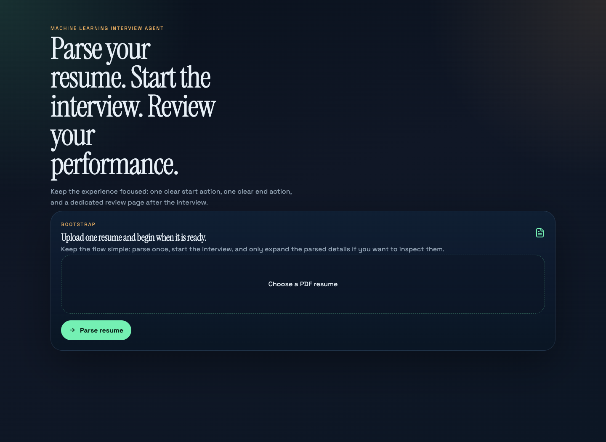
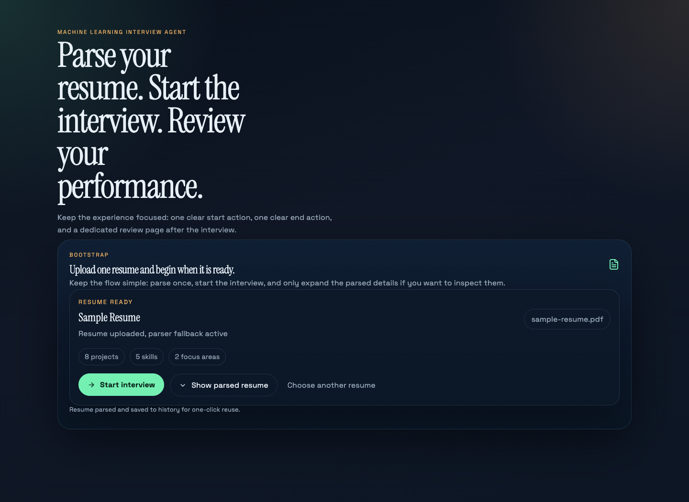
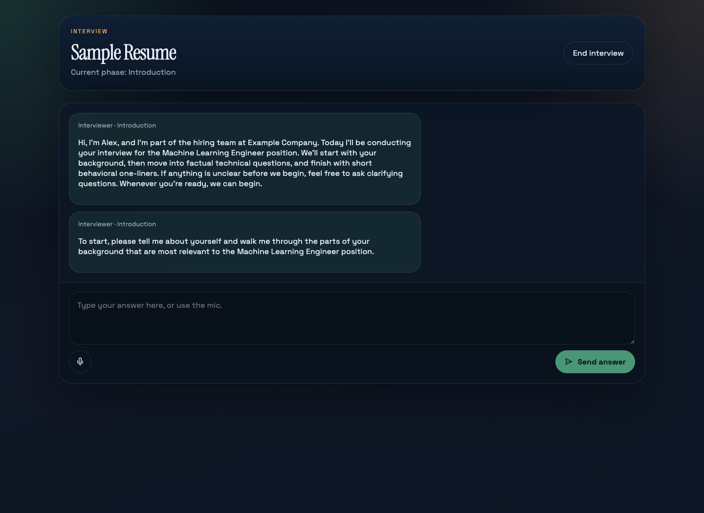
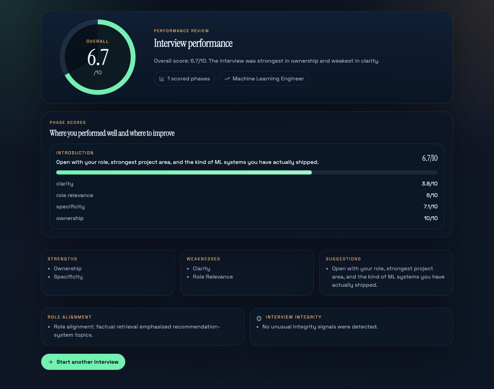

# Interviewing Agent

Interviewing Agent is an audio-first mock interview system for Machine Learning, GenAI, and adjacent engineering roles. It uses a candidate resume and target job description to run a structured interview, probe technical depth, retrieve factual questions, and generate evidence-based feedback.

Live application: [interviewing-agent-skshatanvirpm.onrender.com](https://interviewing-agent-skshatanvirpm.onrender.com)

The hosted interface requires a deployment access token. The token is not embedded in the site or repository.



## Current capabilities

- PDF resume ingestion with OpenAI-backed parsing and a deterministic local fallback
- Five-phase interview orchestration
- Resume- and role-aware project questioning
- Curated ML question retrieval with 384-dimensional embeddings
- Turn-based audio transcription and interviewer speech
- Hint recovery and anxiety-aware interview responses
- Phase scoring, weighted final scoring, and a dedicated review page
- Supabase persistence for resumes, sessions, transcripts, and evaluations
- Optional camera preview, browser integrity signals, and realtime-assist mode
- API tests and web lint, typecheck, build, and CI workflows
- Protected Render deployment with hosted route, CORS, API, and provider smoke tests

The realtime-assist feature is browser-assisted interaction, not a full duplex model-streaming implementation. Camera support is a local preview and consent signal; the application does not perform facial or behavioral video analysis.

## Repository structure

```text
apps/
  api/                     FastAPI application, services, and tests
  web/                     Next.js application
docs/
  assets/screenshots/        Synthetic-data interface screenshots
  archive/discovery/       Historical product discovery material
  audits/                  Repository and codebase assessments
  decisions/               Architecture decision records
  examples/                Version-safe project input examples
scripts/                   Data preparation and environment helpers
supabase/                  Database schema
PRD.md                     Product requirements and scope
TASKS.md                   Work breakdown and implementation status
SPRINTS.md                 Version-based delivery history
WALKTHROUGH.md             Current architecture and feature flow
```

Local resumes, credentials, and other private material belong under `private/`, which is excluded from version control.

## Prerequisites

- Node.js 22
- Python 3.12 or later
- [`uv`](https://docs.astral.sh/uv/)

## Configuration

Copy `.env.example` to `.env` and provide the required values:

```bash
cp .env.example .env
```

Required for model-backed functionality:

- `OPENAI_API_KEY`

Required for persistent storage:

- `SUPABASE_URL`
- `SUPABASE_PUBLISHABLE_KEY`
- `SUPABASE_SERVICE_ROLE_KEY`

Operational settings include:

- `INTERVIEWER_NAME`, `INTERVIEW_TARGET_ROLE`, and `INTERVIEW_TARGET_COMPANY`
- `CORS_ALLOWED_ORIGINS`
- `API_ACCESS_TOKEN` and `API_RATE_LIMIT_PER_MINUTE`
- `MAX_RESUME_UPLOAD_BYTES` and `MAX_AUDIO_UPLOAD_BYTES`
- `LOG_LEVEL`

The application contains deterministic fallbacks for selected local flows when provider credentials are unavailable. Environment variables are the supported runtime configuration path.

Resume uploads must be valid PDF files and default to a 10 MB limit. Supported audio uploads default to 25 MB and require a matching filename extension and media type.

Use `docs/examples/sample-resume.pdf` for a synthetic local walkthrough.

## Run locally

Install dependencies:

```bash
npm install
(cd apps/api && uv sync)
```

Start the API:

```bash
npm run dev:api
```

Start the web application in another terminal:

```bash
npm run dev:web
```

The web application uses `http://127.0.0.1:8000` by default. Set `NEXT_PUBLIC_API_URL` to use another API address.

## Verification

```bash
npm run test:api
npm run lint:web
npm run typecheck:web
npm run build:web
```

Hosted verification commands are documented in [Testing](docs/testing.md).

## Project documents

- [Product requirements](PRD.md)
- [Task status](TASKS.md)
- [Sprint history](SPRINTS.md)
- [Implementation walkthrough](WALKTHROUGH.md)
- [Documentation index](docs/README.md)
- [Architecture](docs/architecture.md)
- [API reference](docs/api.md)
- [Configuration](docs/configuration.md)
- [Testing](docs/testing.md)
- [Deployment](docs/deployment.md)
- [Security and privacy](docs/security.md)
- [Limitations](docs/limitations.md)
- [Release checklist](docs/release-checklist.md)
- [Codebase audit](docs/audits/codebase-audit.md)

## Interface walkthrough

| Resume ready | Interview | Performance review |
| --- | --- | --- |
|  |  |  |

All committed screenshots and examples use synthetic data.

## License

Released under the [MIT License](LICENSE). See [ADR-006](docs/decisions/README.md#adr-006--mit-license).

## Deployment status

The static web application and FastAPI service are deployed on Render:

- Web: [interviewing-agent-skshatanvirpm.onrender.com](https://interviewing-agent-skshatanvirpm.onrender.com)
- API health: [interviewing-agent-api-skshatanvirpm.onrender.com/health](https://interviewing-agent-api-skshatanvirpm.onrender.com/health)

Render automatically deploys changes from `main`, and GitHub Actions verifies the hosted web routes and CORS policy. The hosted environment uses an API access token and global request limit. Supabase persistence and the remaining production security/privacy controls are not configured, so the hosted instance is a bounded project demonstration rather than a production service.
