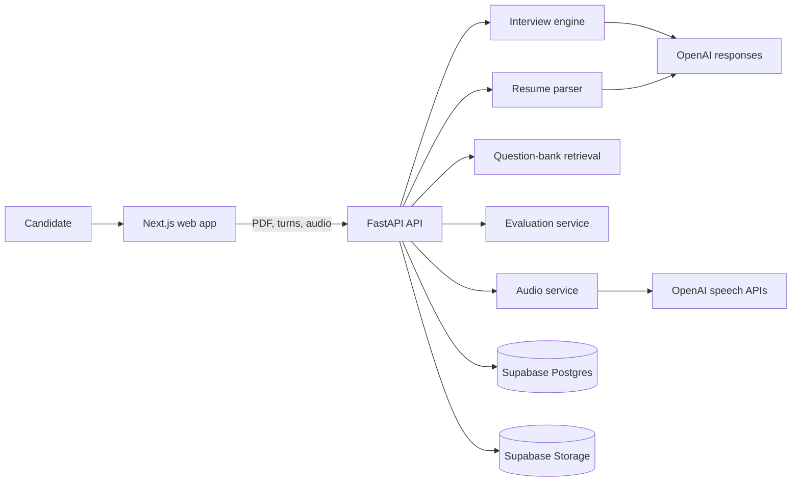
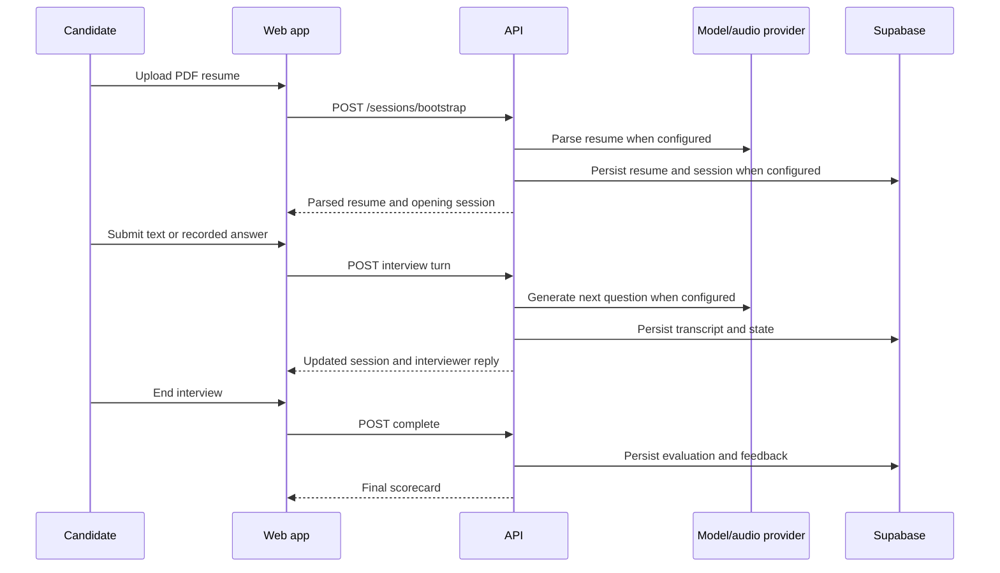

# Architecture

## System overview

Interviewing Agent is a two-application monorepo:

- a Next.js browser client for resume onboarding, interview turns, optional audio/camera interaction, and review;
- a FastAPI service for resume parsing, interview state, retrieval, evaluation, audio providers, and persistence.

OpenAI-backed features and Supabase persistence sit behind backend service boundaries. Deterministic fallbacks keep the core interview loop testable without provider credentials.

## Runtime flow

## Backend boundaries

| Component | Responsibility |
| --- | --- |
| `routes/` | HTTP contracts, dependency injection, and upload validation |
| `services/resume_parser.py` | PDF parsing, normalization, and domain inference |
| `services/interview_engine.py` | Phase state machine, questioning, hints, and fallback behavior |
| `services/question_bank.py` | Question loading, embeddings, ranking, and duplicate avoidance |
| `services/evaluation.py` | Per-phase evidence, scoring, and final feedback |
| `services/audio.py` | Speech-to-text and text-to-speech provider calls |
| `services/persistence.py` | Supabase REST and Storage integration |
| `models.py` | API and domain contracts |
| `config.py` | Environment-backed settings and configuration validation |

## Frontend boundaries

| Component | Responsibility |
| --- | --- |
| `resume-uploader.tsx` | Upload, parsed preview, fingerprinting, and local parsed-resume history |
| `interview-shell.tsx` | Session restore, turn submission, recording, and integrity metadata |
| `realtime-listener.tsx` | Optional browser speech-recognition mode |
| `video-preview.tsx` | Optional local camera preview |
| `review-shell.tsx` | Completed-session restoration |
| `final-feedback-panel.tsx` | Scores, evidence, strengths, weaknesses, and suggestions |
| `lib/api.ts` | Typed client calls |
| `lib/types.ts` | Frontend mirrors of backend contracts |

## State and persistence

The browser stores the latest bootstrap/session snapshot and up to eight parsed-resume history records in `localStorage`. The API keeps an in-memory session cache. When Supabase is configured, it persists:

- candidate and parsed resume data;
- original resume files in a private bucket;
- interview state and messages;
- phase evaluations and final feedback;
- optional interaction and integrity metadata.

The current design is suitable for local and single-worker use. Multi-worker deployment requires an authoritative shared session strategy or explicit optimistic concurrency.

## AI and retrieval behavior

- The interview and resume services use configured OpenAI models.
- The project-authored question bank is converted into 384-dimensional embeddings.
- A hashing embedding fallback keeps retrieval deterministic without optional local model packages.
- Provider failure falls back to deterministic questioning or local PDF extraction where possible.
- Evaluation uses explicit phase weights and evidence-oriented dimensions.

## Trust boundaries

- Provider and Supabase credentials remain server-side.
- The browser receives session and evaluation data but not service-role credentials.
- Upload validation occurs before parsing or transcription.
- CORS origins are configured explicitly.
- Authentication, rate limiting, Row Level Security policies, and retention/deletion APIs remain release prerequisites for public production use.
